# Tunefy — Premium Music Client

<p align="center">
  
</p>

<p align="center">
  <strong>A powerful, privacy-focused YouTube Music client built with Flutter.</strong><br/>
  Ad-free · Offline · Synced Lyrics · Liquid Glass UI · Smart Cache
</p>

<p align="center">
  
  
  
  
</p>

---

Tunefy is a feature-rich, privacy-focused YouTube Music client built with Flutter.
It offers a premium ad-free experience with background playback, offline downloads,
synchronized & karaoke lyrics, a modern Liquid Glass UI, smart background caching,
Spotify playlist imports, a sleep timer, and community sharing — with or without an account.

> [!NOTE]
> Tunefy is distributed directly from this repository (APK releases). It is **not** available
> on the Google Play Store.

---

##  Key Features

###  Liquid Glass UI/UX
- **Dynamic Glassmorphic Themes** — Premium styling in both Dark and Light modes using the dynamic `liquid_glass_easy` package. Light Mode features a beautiful, semi-transparent white tint (light glassmorphism) that adapts dynamically to the album art.
- **Custom Shaders & Blur** — High-performance frosted glass panels, overlays, and custom shaders that adapt smoothly to artwork colors.
- **Contrast-Aware Elements** — Status bar icons, player controls, progress sliders, borders, and menus automatically invert colors based on the active theme for perfect legibility.
- **Big Screen & Desktop Optimization** — Optimized player layouts with responsive max-width constraints (up to 1300px), centered dialogs, and a dedicated top search bar and profile dropdown menu for desktop, laptop, and tablet formats.
- **Sleek iOS-Inspired Forms** — Rebuilt music upload/edit menus and notifications using modern pill-shaped inputs and circular badges.

###  Immersive Audio & Synced Lyrics
- **Smooth Word-by-Word Karaoke** — Words in karaoke mode fill up with color gradually in real-time as the artist sings (running at a buttery-smooth 60+ FPS).
- **Line-by-Line Synced Sweep** — Synced lyrics feature a progressive sweep effect across the text, coloring repeated lines sequentially.
- **Active Line Highlight & Scrolling** — Active line slides slightly to the right and lights up. Scrolling or tapping a line glides smoothly rather than jumping abruptly.
- **Lofi Mode** — Transform any track into a Lofi vibe with slowed speed (0.9×), pitch correction, and native reverb effects.
- **Multi-Language Audio & Quality Control** — Detects and switches between available languages and streams in High, Medium, or Low quality.
- **Background Playback & Native Effects** — Keep music playing with the screen off while utilizing platform-specific audio effects.
- **Podcasts** — Rich podcast discovery and playback with a dedicated library.

###  Smart Cache System
- **Asynchronous Background Caching** — Automatically caches the audio stream of newly added tracks in the background upon adding them to playlists, favorites, or the library.
- **Multi-Resolution Artwork Caching** — Downloads and saves both high-resolution and low-resolution thumbnails locally, ensuring immediate visual feedback without network delay.
- **Instant Zero-Wait Playback** — Bypasses network request times entirely for cached tracks, allowing immediate streaming of local audio streams.
- **Bandwidth-Aware Checks** — Skips download queues if a track has already been cached or downloaded to save battery and network data.

###  Discovery, Import & Community
- **Spotify Playlist Import** — Paste any public Spotify playlist URL to instantly import your favorite tracks.
- **Community Feed & Sharing** — Search, stream, and discover tracks uploaded by the community in a dedicated global feed.
- **Artist Following** — Follow your favorite artists and channels directly from their profile pages to easily keep track of them.
- **Smart Queue & Infinite Playback** — Queue clearing successfully empties upcoming songs in auto-queue mode, and disables the clear button when only the active song is playing.
- **Offline Downloads** — Download songs and videos for offline listening.
- **Recently Played Grid** — Compact 2-column grid of recently played tracks on the home screen.
- **Custom Canvas Video Backgrounds** — Support for custom MP4 canvas video backgrounds with a dedicated uploader dashboard card.

###  Privacy & Accounts
- **Optional Accounts & Cloud Sync** — Create an account or sign in with Google to upload your own tracks and view your Apple-style Profile Card.
- **Privacy First** — No login required. All data (favorites, playlists, history) is stored locally by default.
- **Zero-Wait Launch** — Parallel background loading ensures instant app initialization.
- **Ad-Free & Reliable** — Uninterrupted listening with robust open-source API relays (Last.fm, MusicBrainz, iTunes RSS) to guarantee playback.
- **Share to Play** — Share links from YouTube or YouTube Music directly into Tunefy.
- **Tunefy Deep Linking** — Full custom URL scheme support to instantly open/play songs, artists, albums, and playlists directly via browser links or shared integration URLs.

---

##  Localisation Status

Tunefy is fully localised and supports multiple languages. Below is the translation completion status for each supported language:

| Language | Code | Progress | Coverage |
| :--- | :---: | :--- | :---: |
| **English** | `en` | ████████████████████ | 100% |
| **Hindi** | `hi` | ████████████████████ | 100% |
| **Bengali** | `bn` | ████████████████████ | 100% |
| **Arabic** | `ar` | ████████████████████ | 100% |
| **Russian** | `ru` | ████████████████████ | 100% |
| **Spanish** | `es` | ████████████████████ | 100% |
| **French** | `fr` | ████████████████████ | 100% |
| **German** | `de` | ████████████████████ | 100% |
| **Japanese** | `ja` | ████████████████████ | 100% |
| **Kazakh** | `kk` | ████████████████████ | 100% |
| **Telugu** | `te` | ████████████████████ | 100% |
| **Assamese** | `as` | ████████████████████ | 100% |
| **Chinese** | `zh` | ████████████████████ | 100% |
| **Punjabi** | `pa` | ████████████████████ | 100% |
| **Polish** | `pl` | ████████████████████ | 100% |
| **Portuguese**| `pt` | ████████████████████ | 100% |
| **Serbian** | `sr` | ████████████████████ | 100% |
| **Turkish** | `tr` | ████████████████████ | 100% |
| **Urdu** | `ur` | ████████████████████ | 100% |
| **Korean** | `ko` | ████████████████████ | 100% |

---

##  Screenshots

###  Home & Navigation

<p align="center">
  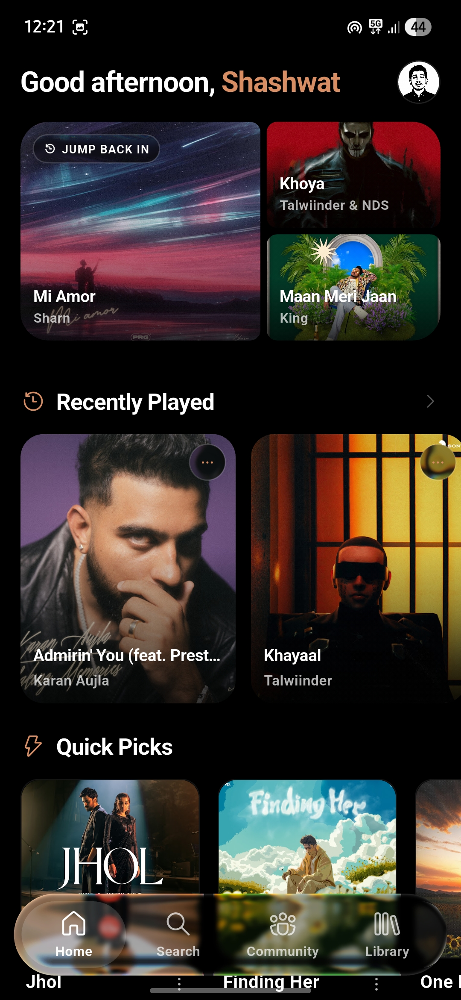
  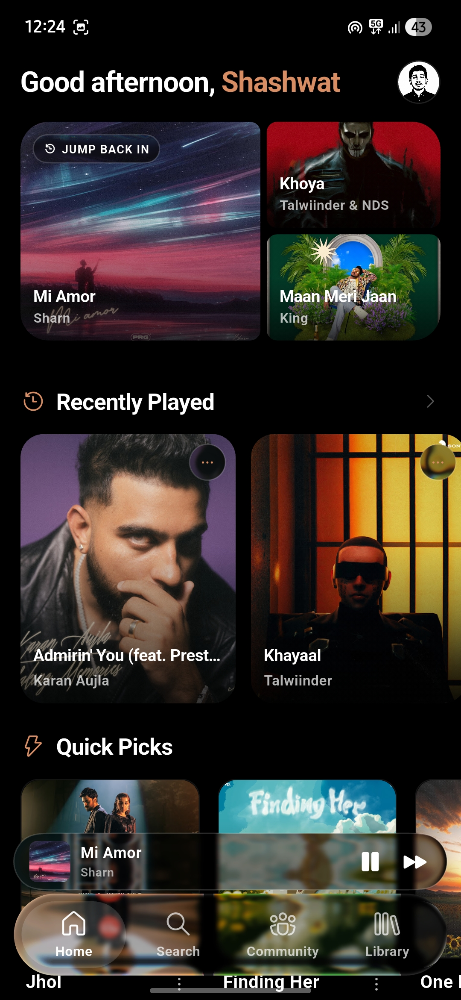
  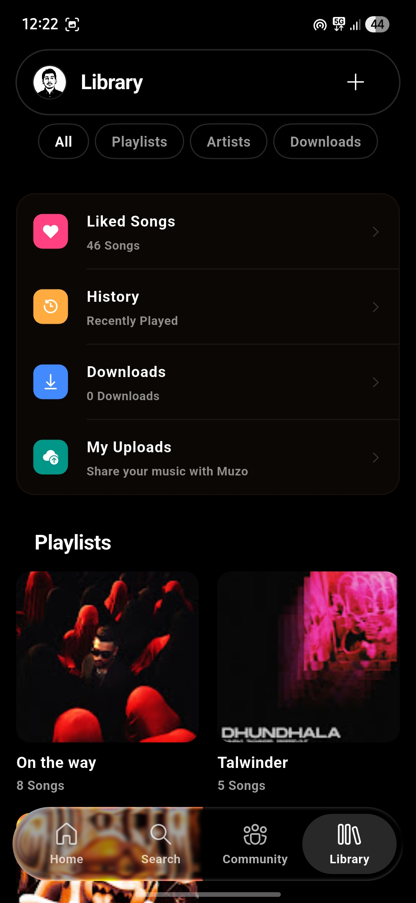
</p>

###  Search

<p align="center">
  
  
</p>

###  Player

<p align="center">
  
  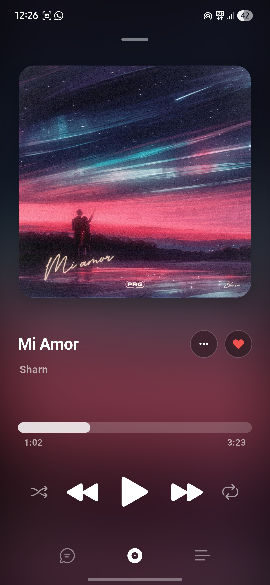
  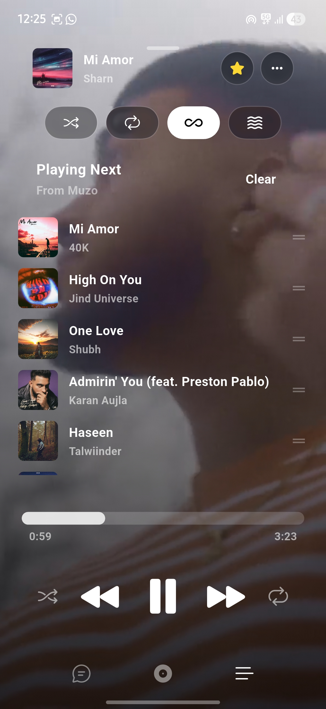
</p>

###  Lyrics

<p align="center">
  
  
</p>

###  Community & Profile

<p align="center">
  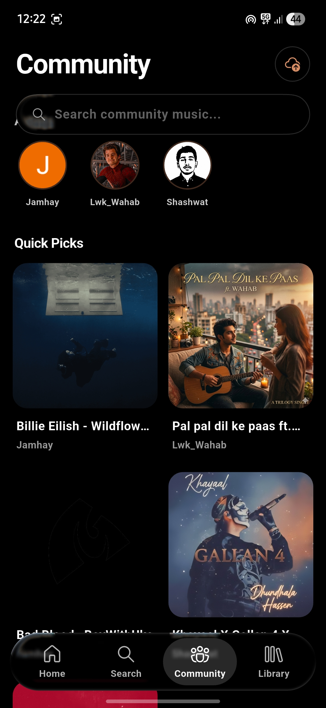
  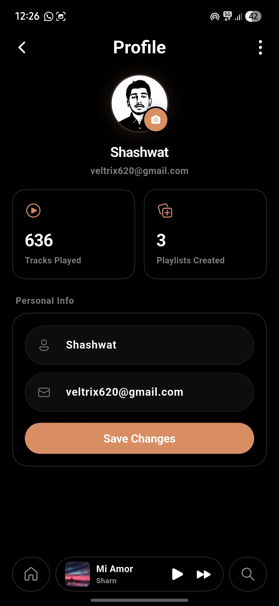
</p>

###  Settings & Customization

<p align="center">
  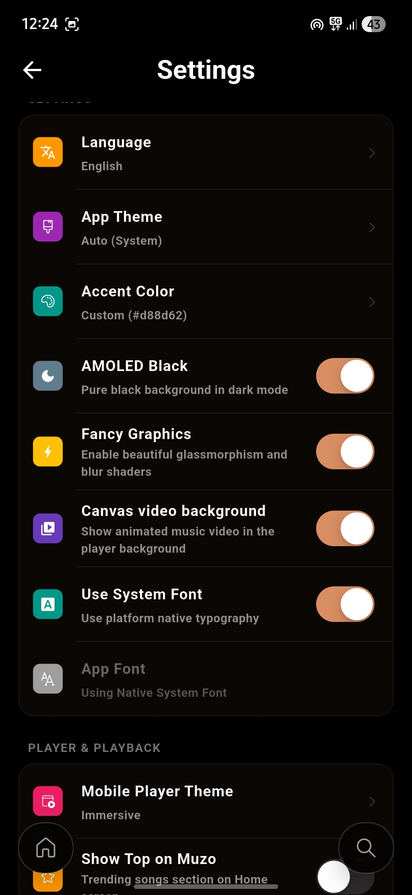
  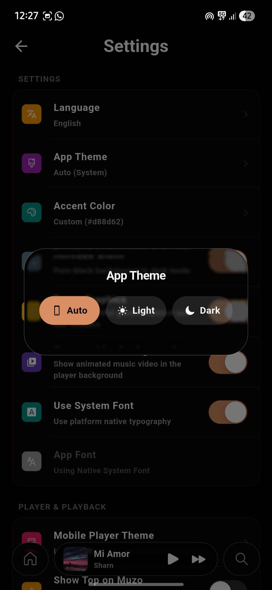
  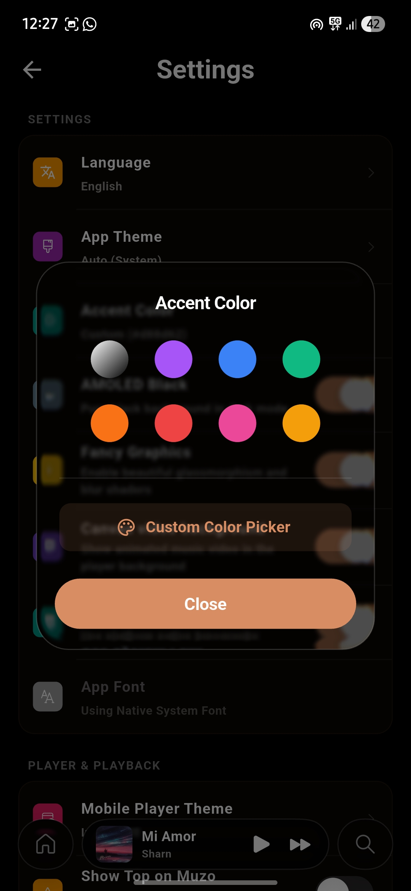
  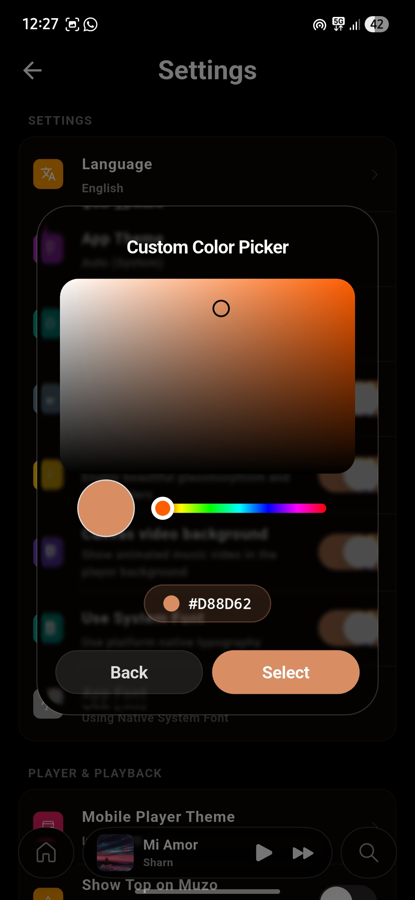
  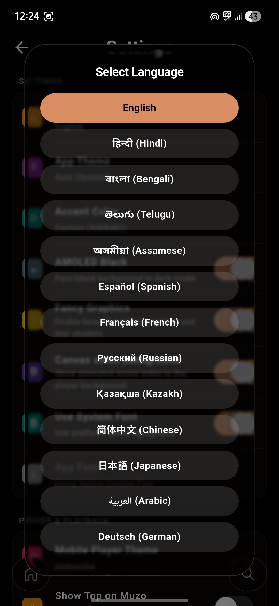
</p>

###  About

<p align="center">
  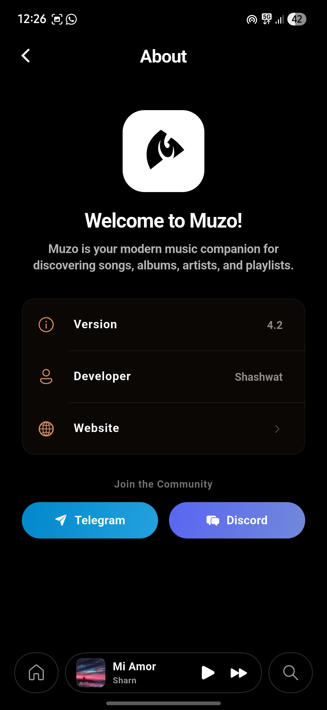
</p>

---

##  Tech Stack

| Layer | Technology |
|---|---|
| **Framework** | [Flutter](https://flutter.dev/) + [Dart](https://dart.dev/) |
| **State Management** | [Riverpod](https://riverpod.dev/) |
| **Audio Engine** | [Just Audio](https://pub.dev/packages/just_audio) & [Audio Service](https://pub.dev/packages/audio_service) |
| **YouTube Extraction** | [youtube_explode_dart](https://github.com/Hexer10/youtube_explode_dart) (fork by [anandnet](https://github.com/anandnet)) |
| **Music Metadata API** | Open APIs — last.fm, MusicBrainz, iTunes RSS + YouTube Music |
| **Lyrics** | [flutter_lyric](https://pub.dev/packages/flutter_lyric) + custom karaoke engine |
| **Local Storage** | [Hive](https://docs.hivedb.dev/) |
| **Networking** | [Dio](https://pub.dev/packages/dio) & [Http](https://pub.dev/packages/http) |
| **UI Components** | `liquid_glass_easy`, [FluentUI System Icons](https://pub.dev/packages/fluentui_system_icons), [Google Fonts](https://pub.dev/packages/google_fonts), [Cached Network Image](https://pub.dev/packages/cached_network_image) |
| **API** | Custom YouTube Internal API + open-source relays (fallback) |

---

##  Setup & Installation

### Prerequisites

- Flutter SDK (Latest Stable)
- Dart SDK
- Android Studio / VS Code
- Java JDK 17

### Installation

1. **Clone the repository:**
   ```bash
   git clone https://github.com/grandelagbanou28-gif/tunefy-music.git
   cd tunefy-music
   ```

2. **Install dependencies:**
   ```bash
   flutter pub get
   ```

3. **Run the app:**
   ```bash
   flutter run
   ```

4. **Build release APK** (split by ABI for smaller size):
   ```bash
   flutter build apk --split-per-abi
   ```

---

##  Contributing

Contributions are welcome! Whether it's reporting a bug, suggesting a feature, or writing code, your help is appreciated.

### How to Contribute

1. **Fork the Project**
2. **Create your Feature Branch** (`git checkout -b feature/AmazingFeature`)
3. **Commit your Changes** (`git commit -m 'Add some AmazingFeature'`)
4. **Push to the Branch** (`git push origin feature/AmazingFeature`)
5. **Open a Pull Request**

### Development Guidelines

- Follow the existing code style.
- Use `flutter analyze` to check for linting errors.
- Ensure new features are tested before submitting a PR.

---

##  Acknowledgements

Tunefy wouldn't exist without the incredible work of these developers and projects. Huge thanks to:

###  youtube_explode_dart
A massive thank you to **[Hexer10](https://github.com/Hexer10)**, the original author of [youtube_explode_dart](https://github.com/Hexer10/youtube_explode_dart) — the backbone of Tunefy's YouTube streaming and metadata extraction. Also special thanks to **[anandnet](https://github.com/anandnet)** for maintaining an up-to-date fork that keeps Tunefy working with the latest YouTube changes.

###  Animesh (n-ce) — fast-saavn & ytify
An enormous shoutout to **[Animesh (n-ce)](https://github.com/n-ce)** — creator of:
- **[fast-saavn](https://github.com/n-ce/saavn)** — the blazing-fast, open JioSaavn API that powers Tunefy's music metadata, song details, and search results.
- **[ytify](https://github.com/n-ce/ytify)** — a beautifully minimal YouTube audio streaming web app that was a **huge source of inspiration** during Tunefy's development. Animesh's approach to UI, UX, and YouTube audio handling influenced many of Tunefy's design decisions. Thank you for the open-source spirit and for being so helpful throughout the development journey!

###  Open-Source Libraries
Tunefy stands on the shoulders of these amazing Flutter/Dart packages:

| Package | Author / Maintainers |
|---|---|
| [just_audio](https://pub.dev/packages/just_audio) | [Ryan Heise](https://github.com/ryanheise) |
| [audio_service](https://pub.dev/packages/audio_service) | [Ryan Heise](https://github.com/ryanheise) |
| [riverpod](https://pub.dev/packages/flutter_riverpod) | [Remi Rousselet](https://github.com/rrousselGit) |
| [hive](https://pub.dev/packages/hive) | [Hive Authors](https://github.com/hivedb/hive) |
| [flutter_lyric](https://pub.dev/packages/flutter_lyric) | [lyric contributors](https://pub.dev/packages/flutter_lyric) |
| [palette_generator](https://pub.dev/packages/palette_generator) | [Flutter Team](https://github.com/flutter/packages) |
| [cached_network_image](https://pub.dev/packages/cached_network_image) | [Baseflow](https://github.com/Baseflow/flutter_cached_network_image) |
| [dio](https://pub.dev/packages/dio) | [cfug](https://github.com/cfug/dio) |
| [flutter_animate](https://pub.dev/packages/flutter_animate) | [gskinner](https://github.com/gskinner/flutter_animate) |
| [google_sign_in](https://pub.dev/packages/google_sign_in) | [Flutter Team](https://github.com/flutter/packages) |
| [app_links](https://pub.dev/packages/app_links) | [Julien Eluard](https://github.com/llfbandit) |

---

##  License

Distributed under the **MIT License**. See [`LICENSE`](LICENSE) for more information.

---

## Backend API (`backend/`)

Le dossier [`backend/`](backend/) contient l'API Node.js/Express qui alimente l'app
(YouTube Music via youtubei.js, plus des sources ouvertes : Last.fm pour les genres,
MusicBrainz pour les nouvelles sorties et les décennies).

| Endpoint | Description |
| --- | --- |
| `/api/search` | Recherche musique / vidéos |
| `/api/trending` | Tendances |
| `/api/charts` | Charts YT Music |
| `/api/playlist/:id` | Détail playlist |
| `/api/moods` / `/api/moods/:id` | Catégories & moods (fallback Last.fm) |
| `/api/tags?tag=` | Genres top titres/albums (Last.fm) |
| `/api/newreleases` | Nouvelles sorties (MusicBrainz) |
| `/api/decades?year=` | Albums par décennie (MusicBrainz) |
| `/api/categories` | Liste des catégories |

**Localement** : `cd backend && npm install && npm start` (port 8000).

**Déploiement (Vercel)** : importer ce repo sur Vercel, **Root Directory = `backend`**
(`vercel.json` fourni). Voir `backend/README.md` pour Cloudflare/Vercel/Docker.